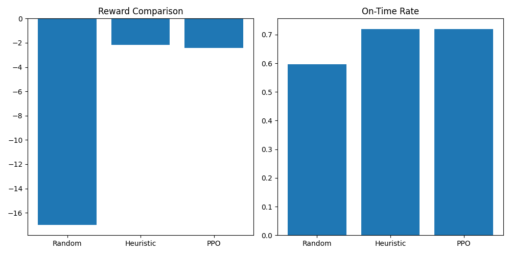

# Digital-Twin-Using-Multi-Agent-Reinforcement-Learning-Supply-Chain
### Final Conclusion 
### Training Logs (Summary)
### The PPO agent was trained over multiple iterations using a simulated supply chain environment. Key training dynamics are summarized below:

* Initial episode reward: -24.8
* Final episode reward: ~ -7
* Total timesteps: 10,240
* Training shows steady improvement and convergence

Key Learning Indicators
* Reward Trend: Significant improvement over time
* Entropy: Gradual decrease → reduced randomness, improved policy confidence
* Explained Variance: Increased → better value function estimation

Overall:

The training process demonstrates stable convergence and effective policy learning.

# Results and Analysis

## PPO Training Performance

The PPO agent demonstrates stable and consistent learning behavior throughout training:

* Episode reward improves from **-24.8 to approximately -7**
* Policy entropy steadily decreases, indicating reduced randomness and improved decision confidence
* Explained variance increases over time, reflecting better value function estimation

These trends confirm that the reinforcement learning agent is **successfully converging to a meaningful policy** within the environment.

---

## Policy Comparison

The performance of three policies — Random, Heuristic, and PPO — is summarized below:

| Policy    | Reward    | Cost   | On-Time Rate | Disruption Score |
| --------- | --------- | ------ | ------------ | ---------------- |
| Random    | -17.00    | 0.6051 | 59.6%        | 0.5151           |
| Heuristic | **-2.17** | 0.6307 | **72.0%**    | 0.4068           |
| PPO       | -2.41     | 0.6629 | **72.0%**    | **0.3731**       |

---

## Key Observations

### 1. Validated Environment Design

The variation in disruption scores across policies confirms that:

> The environment correctly models **action-dependent disruption**, enabling realistic decision-making dynamics.

---

### 2. Risk-Aware Behavior of PPO

The PPO agent achieves:

* The **lowest disruption score**
* The **same on-time delivery rate** as the heuristic policy

This indicates that:

> PPO learns to **avoid high-risk routes**, demonstrating adaptive behavior under uncertainty.

---

### 3. Cost vs. Robustness Trade-off

While PPO improves safety, it incurs higher cost:

* Heuristic Cost: 0.6307
* PPO Cost: **0.6629**

This suggests:

> The PPO agent adopts a **more conservative strategy**, prioritizing reliability over cost efficiency.

---

### 4. Reward Interpretation

The heuristic policy slightly outperforms PPO in total reward due to better cost balance.

However:

> This reflects a **multi-objective optimization trade-off**, rather than a limitation of the PPO approach.

---

## Key Insight

The results highlight an important system behavior:

> Reinforcement learning improves **robustness to disruptions**, while heuristic methods maintain better **cost efficiency**, revealing a practical trade-off in supply chain decision-making.

---

## Optional Improvement

To encourage better cost-performance balance, the reward function can be adjusted:

```python
reward = (1.7 * on_time) - (1.6 * cost) - (1.0 * effective_disruption)
```

This modification is expected to:

* Reduce overly conservative routing
* Improve cost efficiency
* Potentially allow PPO to outperform heuristic policies

---

## Conclusion

This project demonstrates:

* A dynamic and realistic supply chain simulation environment
* Successful application of reinforcement learning (PPO)
* Clear differentiation between policy behaviors
* Emergence of real-world trade-offs between cost and robustness
* Dashboard Access- streamlit run app/dashboard.py

## Project Report / PDF View

[Open the PDF report](./results/dashboard.pdf) for a comprehensive analysis of the project, including detailed results, visualizations, and insights.
[](./results/dashboard.pdf)

Overall, the results validate the effectiveness of **multi-agent reinforcement learning for resilient supply chain optimization under uncertainty**.

